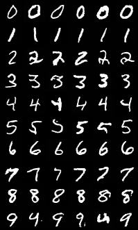
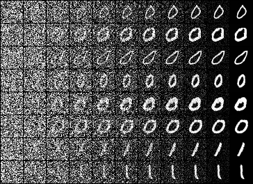
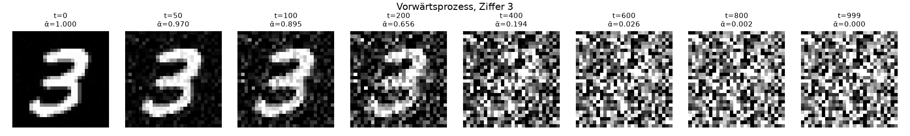
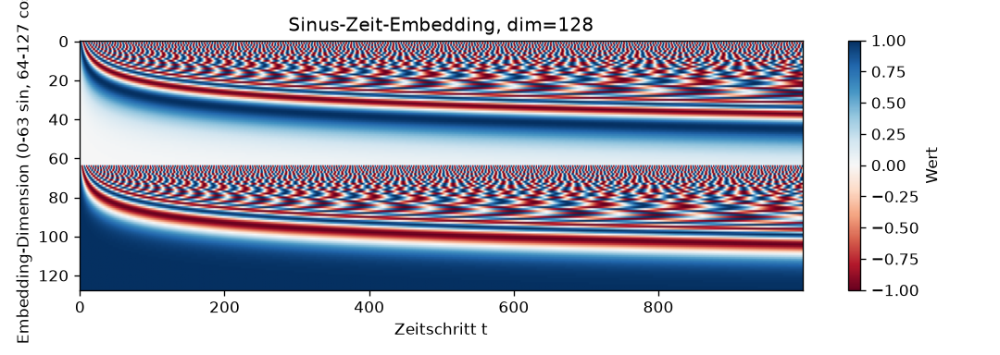
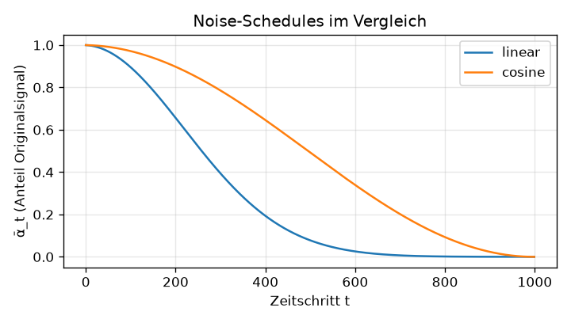
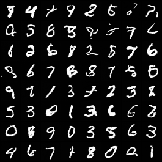
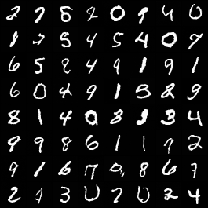
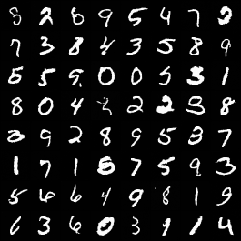

# diffusion-lab: Diffusionsmodelle von Grund auf

Ein DDPM (Denoising Diffusion Probabilistic Model) in wenigen hundert Zeilen PyTorch, trainiert
auf MNIST, auf einem Apple-Silicon-Mac. Kein `diffusers`, kein fertiger Trainer: Vorwärtsprozess,
U-Net, Trainingsziel, zwei Sampler und Classifier-free Guidance sind selbst geschrieben. Darauf
vier kontrollierte Experimente mit einer eigenen Metrik-Pipeline, inklusive der Stellen, an denen
die erste Messung in die Irre führte.

<p align="center">
  
  &nbsp;&nbsp;
  
</p>
<p align="center"><sub>Links: „Erzeuge Ziffer k“ (klassenkonditioniertes Modell, FID 3,9). Rechts: derselbe Prozess Schritt für Schritt, von reinem Rauschen (links) zur fertigen Ziffer (rechts).</sub></p>

> **Portfolio-Kontext.** Zweites Projekt neben [book-RAG](https://github.com/jelteDr/book-RAG).
> Ziel: nicht ein Tutorial nachbauen, sondern verstehen, *warum* Diffusionsmodelle funktionieren,
> und Behauptungen aus Papern am eigenen Setup nachmessen. Ergebnis-Details und alle Zahlen in
> [`docs/RESULTS.md`](docs/RESULTS.md), Fahrplan in [`docs/PLAN.md`](docs/PLAN.md).

---

## Inhalt

1. [Was ein Diffusionsmodell tut](#1-was-ein-diffusionsmodell-tut)
2. [Implementierung](#2-implementierung)
3. [Messmethodik](#3-messmethodik)
4. [Experimente](#4-experimente)
5. [Alle Hebel im Vergleich](#5-alle-hebel-im-vergleich)
6. [Lehren](#6-lehren)
7. [Reproduzieren](#7-reproduzieren)
8. [Ausblick: Stufe 2](#8-ausblick-stufe-2)
9. [Referenzen](#9-referenzen)

---

## 1. Was ein Diffusionsmodell tut

Ein DDPM hat zwei Richtungen. Der **Vorwärtsprozess** ist fest und lernt nichts: Er mischt in
T=1000 Schritten Gauß-Rauschen in ein Bild, bis nur noch Rauschen übrig ist. Dank einer
geschlossenen Form muss man die Schritte nicht nacheinander ausführen, sondern springt direkt
von x₀ zu jedem x_t:

```
x_t = √ᾱ_t · x₀ + √(1 − ᾱ_t) · ε,     ε ~ N(0, I)
```

ᾱ_t ist der Anteil des Originalbilds, der nach t Schritten noch übrig ist. Wie schnell er fällt,
legt der **Noise-Schedule** fest.

<p align="center"></p>

Der **Rückwärtsprozess** ist das, was gelernt wird. Das Netz bekommt ein verrauschtes Bild x_t
und den Zeitschritt t und schätzt, welches Rauschen ε hineingemischt wurde. Das Trainingsziel
ist eine schlichte MSE zwischen echtem und geschätztem Rauschen:

```
L = ‖ ε − ε̂_θ(x_t, t) ‖²      mit zufälligem t und ε pro Trainingsbeispiel
```

Das Netz lernt also nie „Bilder malen“, sondern nur diese Regression. Erst beim **Sampling**
setzt man aus vielen Rauschschätzungen ein Bild zusammen: Man startet bei reinem Rauschen x_T
und geht Schritt für Schritt zurück. Jeder Schritt entfernt etwas geschätztes Rauschen und
addiert (außer im letzten) frisches, kleineres Rauschen dazu.

Damit das Netz weiß, „wie verrauscht“ das Bild gerade ist, wird t als **Sinus-Embedding**
kodiert (dasselbe Verfahren wie die Positionskodierung im Transformer) und in jedem Block
auf die Feature-Maps addiert. Hohe Frequenzen unterscheiden benachbarte t, niedrige die grobe
Phase:

<p align="center"></p>

---

## 2. Implementierung

| Modul | Inhalt | Zeilen |
|-------|--------|-------:|
| `ddpm/schedule.py` | linearer und Cosinus-Schedule, `q_sample` (Vorwärtsprozess) | ~90 |
| `ddpm/model.py` | Sinus-Zeit-Embedding, ResBlock (GroupNorm, SiLU, Zeit-Einspeisung), U-Net mit 3 Auflösungsstufen und Skip-Verbindungen, optionales Klassen-Embedding | ~150 |
| `ddpm/train.py` | Trainingsschritt (ε-Prediction), AdamW, EMA der Gewichte, Label-Dropout für CFG, Checkpoints, Loss-Kurve, Überschreib-Sperre | ~150 |
| `ddpm/sample.py` | DDPM-Sampler (ancestral), DDIM-Sampler (η ∈ [0, 1]), Classifier-free Guidance, Trajektorien | ~230 |
| `ddpm/classifier.py` | MNIST-Klassifikator als „Richter“ (99,0 % Test-Genauigkeit) | ~90 |
| `ddpm/evaluate.py` | IS- und FID-Analogon, Label-Treffer, Mehrfach-Seeds mit Mittelwert ± Streuung | ~180 |

**U-Net** für 32×32 (MNIST mit 2 Pixel Rand): base=32 ergibt Kanäle 32 → 64 → 128 auf
32 → 16 → 8 Pixeln, 2,17 M Parameter. Kein Attention-Block, bewusst minimal.

**Konditionierung**: ein lernbarer Vektor pro Klasse (plus ein „Null-Label“) wird auf das
Zeit-Embedding addiert. Beim Training werden 10 % der Labels durch das Null-Label ersetzt,
sodass dasselbe Netz konditioniert und unkonditioniert vorhersagen kann. Beim Sampling werden
beide Vorhersagen kombiniert (Classifier-free Guidance, Ho & Salimans 2022):

```
ε̂ = ε̂_uncond + w · (ε̂_cond − ε̂_uncond)
```

**Hardware**: Apple M5, 24 GB Unified Memory, PyTorch über Metal (MPS). 20 Epochen dauern
15 min (base 16), 30 min (base 32) bzw. 2 h (base 64).

---

## 3. Messmethodik

„Sieht besser aus“ reicht nicht. Deshalb bewertet ein auf echten Ziffern trainierter
Klassifikator die generierten Bilder, in Anlehnung an die Standardmaße der Bildgenerierung:

- **IS** (Inception-Score-Analogon): hoch, wenn jedes Bild eindeutig eine Ziffer ist *und* alle
  zehn Ziffern vorkommen. Maximum 10.
- **FID** (Fréchet-Distanz): Abstand zwischen der Merkmalsverteilung generierter und echter
  Bilder. Niedriger ist besser.
- **Label-Treffer** (nur konditioniert): Anteil, bei dem der Richter die angeforderte Ziffer erkennt.

Referenz mit echten MNIST-Bildern (n=5000): IS 9,75 · FID 1,7.

Zwei Regeln, die sich im Projekt als entscheidend erwiesen haben (siehe [Lehren](#6-lehren)):
**mindestens 5000 Bilder pro Messung** und **gepaarte Seeds**, d. h. alle Modelle starten pro
Seed vom identischen Rauschen, damit die Differenz pro Seed zur Messgröße wird. Jede Zahl unten
ist ein Mittelwert ± Streuung über 3 Seeds.

---

## 4. Experimente

Alle Läufe: 20 Epochen, Batch 128, AdamW 2·10⁻⁴, EMA 0,999, Seed 0. Bewertung mit dem
DDIM-Sampler (η=1, 100 Schritte), n=5000, 3 Seeds. Jede Hypothese wurde *vor* der Messung
notiert.

### Exp 1: Linearer vs. Cosinus-Schedule

**Hypothese:** Der Cosinus-Schedule (Nichol & Dhariwal 2021) verteilt die Bildentstehung
gleichmäßiger über die Schritte und liefert bessere Bilder bei gleichem Budget.

<p align="center"></p>

| Schedule | IS ↑ | FID ↓ | FID je Seed |
|----------|-----:|------:|-------------|
| linear | 8,81 | 11,9 ± 1,0 | 10,8 / 12,1 / 12,8 |
| cosine | 8,80 | **11,1 ± 0,9** | 10,7 / 12,1 / 10,5 |

**Befund: allenfalls ein kleiner Vorteil für Cosinus, nicht robust.** Gepaart in 2 von 3 Seeds
besser, ein Seed praktisch gleich. Der qualitative Effekt ist dagegen klar sichtbar: Beim
Cosinus-Modell werden Ziffern schon ab t≈800 erkennbar, beim linearen erst ab t≈400
([Trajektorien](docs/img/trajectory_cosine.png)). Die Trainings-Loss (0,031 vs. 0,018) ist
zwischen Schedules **nicht vergleichbar**, weil der lineare Schedule für die Hälfte aller t
eine triviale Aufgabe stellt (x_t ≈ ε).

Dieses Experiment hat mit n=1000 zunächst das *Gegenteil* nahegelegt (Cosinus 6 FID-Punkte
schlechter). Ein zweiter Seed zeigte, dass derselbe Lauf um 6 Punkte schwankt. Details in
[`docs/RESULTS.md`](docs/RESULTS.md#exp-1-linearer-vs-cosinus-schedule).

### Exp 2: DDIM, Sampling-Schritte vs. Qualität

**Hypothese:** DDIM (Song et al. 2021) mit 50 Schritten ist ~20× schneller als DDPM mit 1000
bei geringem Qualitätsverlust.

<p align="center"></p>

**Befund: nur mit Stochastik.** Deterministisches DDIM (η=0) verdoppelt den FID bei 50
Schritten, wird ab 100 nicht besser und bei 250 sogar schlechter. Mit η=1 (frisches Rauschen
pro Schritt) fällt die Kurve monoton und erreicht bei 250 Schritten den DDPM-Wert bei 4,7-facher
Geschwindigkeit; 50 Schritte (23×) kosten 4 FID-Punkte. Interpretation nach Karras et al.
(2022): Ein deterministischer Sampler folgt der Bahn eines unvollkommenen ε-Schätzers umso
genauer, je mehr Schritte er macht. Stochastik „vergisst“ angesammelte Fehler.
**Empfehlung für dieses Modell: DDIM η=1, 50–100 Schritte.**

### Exp 3: Modellgröße

**Hypothese:** Mehr Parameter verbessern den FID deutlich.

<p align="center"></p>

| base | Parameter | Training (20 Ep.) | IS ↑ | FID ↓ |
|-----:|----------:|------------------:|-----:|------:|
| 16 | 0,67 M | 15 min | 8,15 | 32,4 ± 2,4 |
| 32 | 2,17 M | 30 min | 8,80 | 11,1 ± 0,9 |
| 64 | 8,10 M | 2 h | **9,15** | **6,6 ± 0,8** |

**Befund: bestätigt, Faktor 5 im FID.** Der Trainings-Loss der drei Modelle unterscheidet
sich nur in der dritten Nachkommastelle. Die Loss-Kurve des großen Modells ist bei Epoche 20
noch nicht flach.

<p align="center">
  
  
  
</p>
<p align="center"><sub>base 16 · 32 · 64, jeweils DDIM η=1, 100 Schritte, gleiches Start-Rauschen</sub></p>

### Exp 4: Klassen-Konditionierung und Classifier-free Guidance

**Hypothese:** Konditionierung trifft die Ziffer zuverlässig; Guidance w≈2–4 verbessert
Treffer und Schärfe, zu großes w reduziert die Vielfalt.

<p align="center"></p>

| w | IS ↑ | FID ↓ | Label-Treffer |
|--:|-----:|------:|--------------:|
| 0 (unkonditioniert) | 7,80 | 56,4 | 10 % |
| **1** | 9,56 | **3,9 ± 0,6** | 96 % |
| 1,25 | 9,83 | 9,1 | 99 % |
| 2 | 9,97 | 36,5 | 100 % |
| 7 | 9,99 | 98,8 | 100 % |

**Befund 1: Konditionierung ist der stärkste Hebel des Projekts.** Das konditionierte
base-32-Modell (FID 3,9) schlägt das viermal größere unkonditionierte base-64-Modell (6,6).
Das Label nimmt dem Netz die schwerste Entscheidung ab.

**Befund 2: Das FID-Optimum liegt bei w=1, die Hypothese ist widerlegt.** Ab w=1,25 steigt der
FID, obwohl Label-Treffer, Konfidenz und IS ihr Maximum erreichen. Das ist der klassische
**Treue-Vielfalt-Konflikt**: Guidance schiebt jedes Bild zum Prototyp seiner Klasse, der Richter
ist begeistert, der FID bestraft den Verlust der Randfälle. Sichtbar im Vergleich
[w=1](docs/img/cond_w1.png) gegen [w=7](docs/img/cond_w7.png): dickere, gleichförmigere
Striche. Bei SDXL liegt das Optimum bei 5–7,5, weil ein Text-Prompt viel mehr Spielraum lässt
als zehn Ziffern.

---

## 5. Alle Hebel im Vergleich

| Hebel | FID (n=5000) | Kosten |
|-------|-------------:|--------|
| **Klassen-Konditionierung** (base 32) | 11,1 → **3,9** | Labels nötig, sonst keine |
| **Modellgröße** base 16 → 64 | 32,4 → 6,6 | 8,6× Trainingszeit, 4× Sampling |
| Sampler DDIM η=0 → η=1 (50 Schritte) | 36 → 21 (n=1000) | keine |
| Sampling-Schritte η=1, 50 → 250 | 21 → 17 (n=1000) | 5× Sampling-Zeit |
| Schedule linear → cosine | 11,9 → 11,1 (nicht robust) | keine |

Das Muster deckt sich mit der Entwicklung großer Modelle: Konditionierung und Kapazität
schlagen fast alle Tricks. Schedule und Sampler sind das Feintuning, wenn Kapazität und
Rechenzeit ausgereizt sind.

---

## 6. Lehren

**Methodisch**

1. **Die Streuung einer Metrik muss bekannt sein, bevor man Effekte interpretiert.** Mit n=1000
   schwankte der FID desselben Modells um 6 Punkte, so viel wie der vermeintliche Effekt in
   Exp 1. Mit n=5000 sank die Streuung auf ~1. Ein Referenzvergleich „echt gegen echt“
   unterschätzt die Streuung generierter Bilder.
2. **Gepaarte Seeds.** Gleiches Start-Rauschen für alle Modelle macht die Differenz pro Seed zur
   Messgröße und filtert einen Großteil des Zufalls heraus.
3. **Die Trainings-Loss ist zwischen Setups kein Qualitätsmaß.** Drei Modelle mit fast gleicher
   ε-MSE lagen im FID um Faktor 5 auseinander; zwei Schedules mit sehr verschiedener Loss lagen
   gleichauf.
4. **Metriken widersprechen sich zu Recht.** IS und Label-Treffer belohnen Prototypen, der FID
   bestraft fehlende Vielfalt. Die Wahl der Metrik ist eine Entscheidung darüber, was zählt.

**Technisch**

5. **Ein Bug in gemeinsamer Infrastruktur verzerrt still alle Messungen.** Der DDIM-Schritt
   clampte x̂₀, rechnete aber mit dem ungeclampten ε̂ weiter. Ohne Guidance wirkte das nur mild
   (~1–5 FID-Punkte), mit Guidance zerfielen die Bilder. Fix wie in `diffusers`: ε̂ nach dem
   Clamp zurückrechnen. Alle Experimente wurden danach neu gemessen.
6. **Ergebnisse gegen Überschreiben sichern.** Ein Trainingsaufruf ohne `--run` hätte das
   Basismodell überschrieben. Seitdem bricht `train.py` bei vorhandenem Lauf ab.
7. **Stochastik im Sampler ist kein Detail.** Bei einem kleinen Modell ist η=1 gegen η=0 ein
   größerer Hebel als die Schrittzahl.

---

## 7. Reproduzieren

Voraussetzung: [uv](https://docs.astral.sh/uv/), Python 3.12. MNIST wird beim ersten Lauf
geladen (~10 MB). Alle Artefakte landen unter `runs/<name>/` (nicht im Repo).

```bash
uv sync

# Vorwärtsprozess und Zeit-Embedding anschauen
uv run python scripts/forward_demo.py
uv run python scripts/time_embedding_demo.py

# Trainieren (base 32, Cosinus, ~30 min auf M5); --cond für Klassen-Konditionierung
uv run python -m ddpm.train --epochs 20 --run mnist_cosine --schedule cosine
uv run python -m ddpm.train --epochs 20 --run mnist_cond --schedule cosine --cond

# Sampeln: Grid + Trajektorie
uv run python -m ddpm.sample --run mnist_cosine --sampler ddim --ddim-steps 100 --eta 1.0
uv run python -m ddpm.sample --run mnist_cond --sampler ddim --ddim-steps 100 --eta 1.0 --label all --guidance 1

# Bewerten: Richter trainieren, dann IS/FID mit 3 Seeds
uv run python -m ddpm.classifier
uv run python -m ddpm.evaluate --run mnist_cosine --sampler ddim --ddim-steps 100 --eta 1.0 --n 5000 --seeds 0 1 2

# Diagramme
uv run python scripts/plot_loss.py mnist_cosine
uv run python scripts/plot_ddim_sweep.py mnist_cosine
uv run python scripts/plot_guidance.py mnist_cond
```

---

## 8. Ausblick: Stufe 2

Der Plan sieht als zweite Stufe SDXL mit DreamBooth-LoRA vor: Inferenz lokal über MPS,
Training des Adapters auf Kaggle, Bewertung per CLIP-Score. Die Bausteine dieses Projekts
tauchen dort eins zu eins wieder auf: Zeit-Embedding, ε-Prediction, Scheduler-Wahl
(η, Schrittzahl), Guidance-Regler und Konditionierung, nur mit Text statt Klassen-Labels
und im Latent-Raum eines VAE statt auf Pixeln. Offene Fortsetzungen in Stufe 1: base 64 länger
trainieren (Loss noch nicht flach), Sampling mit posterior variance β̃_t als Gegenprobe zu Exp 2.

---

## 9. Referenzen

- Ho, Jain, Abbeel (2020). *Denoising Diffusion Probabilistic Models.* [arXiv:2006.11239](https://arxiv.org/abs/2006.11239)
- Nichol, Dhariwal (2021). *Improved Denoising Diffusion Probabilistic Models.* [arXiv:2102.09672](https://arxiv.org/abs/2102.09672)
- Song, Meng, Ermon (2021). *Denoising Diffusion Implicit Models.* [arXiv:2010.02502](https://arxiv.org/abs/2010.02502)
- Ho, Salimans (2022). *Classifier-Free Diffusion Guidance.* [arXiv:2207.12598](https://arxiv.org/abs/2207.12598)
- Karras, Aittala, Aila, Laine (2022). *Elucidating the Design Space of Diffusion-Based Generative Models.* [arXiv:2206.00364](https://arxiv.org/abs/2206.00364)
- Heusel et al. (2017). *GANs Trained by a Two Time-Scale Update Rule* (FID). [arXiv:1706.08500](https://arxiv.org/abs/1706.08500)
