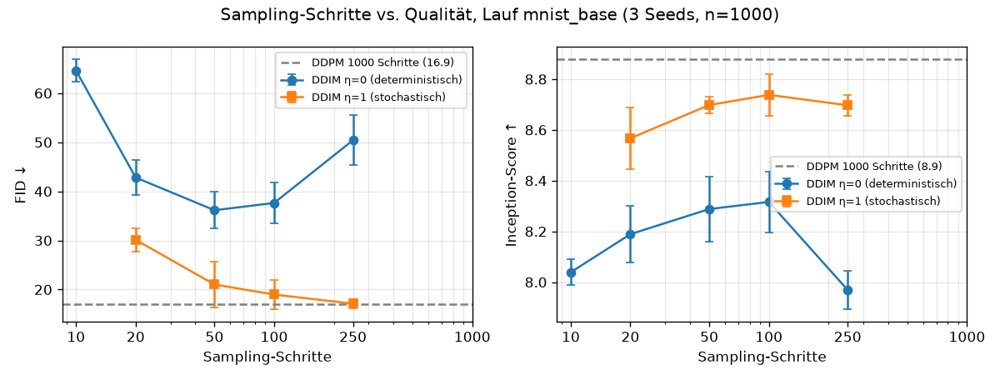
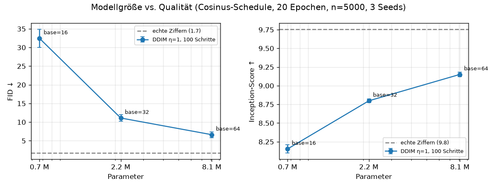
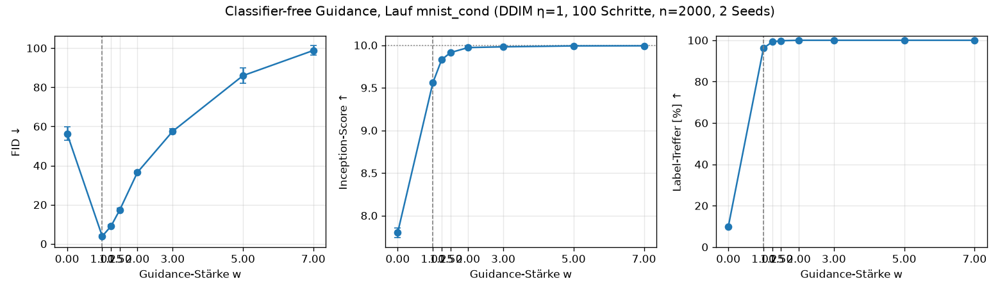

# Ergebnisse der Experimente

Alle Zahlen: MNIST 32x32, U-Net mit 2,17 M Parametern (base=32), 20 Epochen, Batch 128,
AdamW lr 2e-4, EMA 0.999, Seed 0, Apple M5 (MPS). Bewertung mit dem Klassifikator-Richter
(`ddpm/classifier.py`, 99,0 % Test-Genauigkeit) auf 1000 generierten Bildern.

**Referenz (echte MNIST-Bilder):** n=1000: IS 9,71 · FID 5,24 · n=5000: IS 9,75 · FID 1,69.

**Hinweis zur Messversion:** Alle n=5000-Tabellen in Exp 1 und 3 zeigen die **v2-Messung**
mit dem korrigierten DDIM-Schritt (Clamp-Fix aus Exp 4, JSON-Tag `_v2`). Die v1-Werte
(vor dem Fix, ~1–5 FID-Punkte höher, gleiche Rangfolge) sind in Klammern angegeben.
Der FID ist auch zwischen echten Bildern nicht 0, weil 1000 Bilder die Verteilung nur
schätzen. **Achtung:** für generierte Bilder ist die Streuung deutlich größer (siehe Exp 1:
±3 FID-Punkte zwischen zwei Sampling-Seeds desselben Modells).

---

## Exp 1: Linearer vs. Cosinus-Schedule

**Hypothese (vorab):** Der Cosinus-Schedule (Nichol & Dhariwal 2021) verteilt die
Bildentstehung gleichmäßiger über die Zeitschritte (beim linearen Schedule ist ab t≈400
kaum Signal übrig, siehe `docs/img/schedules_alpha_bar.png`). Erwartung: bessere
Bildqualität (niedrigerer FID, höherer IS) bei gleichem Trainingsbudget.

**Aufbau:** identisch bis auf `--schedule`. Sampling: DDPM ancestral, 1000 Schritte,
σ_t = √β_t.

| Lauf | Schedule | Trainings-Loss (Ep. 20) | IS ↑ (Seed 0 / 2) | FID ↓ (Seed 0 / 2) | Konfidenz |
|------|----------|------------------------:|------------------:|-------------------:|----------:|
| mnist_base   | linear | 0,018 | 8,90 / 8,85 → **8,88** | 14,0 / 19,9 → **17,0** | 0,959 |
| mnist_cosine | cosine | 0,031 | 8,72 / 8,82 → **8,77** | 20,0 / 16,6 → **18,3** | 0,956 |

**Befund: kein belastbarer Unterschied.** Nach dem ersten Seed sah der Cosinus-Schedule
mit FID 20,0 gegen 14,0 klar schlechter aus. Ein zweiter Sampling-Seed zeigte jedoch, dass
**derselbe** lineare Lauf zwischen 14,0 und 19,9 schwankt: Die FID-Streuung bei n=1000 ist
so groß wie der vermeintliche Effekt. Der IS ist stabiler (±0,05 beim linearen Modell)
und zeigt einen kleinen Vorsprung für linear (8,88 vs. 8,77), der aber ebenfalls innerhalb
der Cosinus-Streuung (8,72–8,82) liegt. Die Hypothese „Cosinus ist besser" wird damit nicht
bestätigt; „Cosinus ist schlechter" lässt sich aber auch nicht sagen.

**Was sich sicher sagen lässt:** Die Trajektorien zeigen den erwarteten qualitativen Effekt
(Ziffern werden beim Cosinus-Modell schon ab t≈800 sichtbar statt ab t≈400), und die
Trainings-Loss ist zwischen Schedules nicht vergleichbar (beim linearen Schedule ist die
ε-Vorhersage für die Hälfte aller t trivial, weil x_t ≈ ε).

**Methodische Lehre:** Die Streuung einer Metrik muss bekannt sein, bevor man Unterschiede
interpretiert. Der Referenzvergleich „echt gegen echt" (FID 5,2) unterschätzt die Streuung
generierter Bilder deutlich. Der FID ist außerdem bekannt dafür, bei kleinem n nach oben
verzerrt zu sein (128×128-Kovarianz aus 1000 Bildern). Abhilfe: n ≥ 5000 und mehrere Seeds
mit Mittelwert ± Streuung. Beides wird erst mit DDIM (Exp 2) bezahlbar, weil 1000-Schritt-
Sampling ~6 min pro 1000 Bilder kostet.

**Interpretation, warum kein Gewinn (Hypothesen, nicht gemessen):**
- Das Paper (Nichol & Dhariwal 2021) führt den Cosinus-Schedule zusammen mit gelernter
  Varianz und Hybrid-Loss ein; hier ist nur der Schedule getauscht, mit fester Varianz β_t.
- MNIST-Ziffern sind spärliche, einfache Bilder; die Feinstruktur bei kleinem t entscheidet
  über die Erkennbarkeit, und dort investiert der lineare Schedule mehr Trainingsbeispiele.

### Nachmessung mit belastbarer Metrik (nach Exp 2)

Sampler DDIM η=1, 100 Schritte (siehe Exp 2), **n=5000**, 3 Seeds. Beide Modelle bekommen
pro Seed dasselbe Start-Rauschen (gepaarter Vergleich).

| Lauf | IS ↑ | FID ↓ (v2) | FID je Seed (0 / 1 / 2) | FID v1 |
|------|-----:|-----------:|-------------------------|-------:|
| mnist_base (linear)   | 8,81 ± 0,03 | 11,88 ± 1,01 | 10,79 / 12,07 / 12,78 | (14,04) |
| mnist_cosine (cosine) | 8,80 ± 0,05 | **11,10 ± 0,88** | 10,65 / 12,11 / 10,53 | (13,04) |

Die FID-Streuung ist mit n=5000 von ±3–6 auf ~±1 gefallen, und der absolute Wert sinkt
von ~17–19 auf ~12 (bekannte Verzerrung des FID nach oben bei kleinem n).

**Finaler Befund Exp 1: allenfalls ein kleiner Vorteil für den Cosinus-Schedule, nicht
robust.** Im Mittel −0,8 FID, aber gepaart nur in 2 von 3 Seeds besser (Differenzen
+0,14 / −0,04 / +2,25); Seed 1 ist praktisch gleich, der Mittelwert wird von Seed 2 getragen.
In der v1-Messung waren es noch 3 von 3 (−1,0). Im IS kein Unterschied. Das ist weit von dem
entfernt, was die erste Messung mit n=1000 in die *Gegenrichtung* suggeriert hatte.
Nebenbefund: Beide Modelle erzeugen zu viele 7en (12–13 %) und zu wenige 8en (8 %).

**Lehre in einem Satz:** Ohne Kenntnis der Metrik-Streuung hätte dieses Experiment die
falsche Antwort geliefert; mit n=5000 und gepaarten Seeds ist die Antwort klein, aber klar.

**Offen:** Sampling mit σ_t² = β̃_t (posterior variance) als Gegenprobe.

Bilder: `docs/img/schedules_alpha_bar.png`, `docs/img/trajectory_linear.png`,
`docs/img/trajectory_cosine.png`.

---

## Exp 2: DDIM-Sampling — Schritte vs. Qualität

**Hypothese (vorab):** DDIM (Song et al. 2021) mit 50 Schritten ist ~20× schneller als
DDPM mit 1000 Schritten bei nur geringem Qualitätsverlust (FID im Bereich des Basismodells).

**Aufbau:** Basismodell `mnist_base` (linear), kein Neutraining. Sampler DDIM mit
Teilfolge `range(999, -1, -T/k)`, x̂_0 auf [-1, 1] geclampt. η=0 (deterministisch) und
η=1 (stochastisch, DDPM-artige Varianz). Je 3 Sampling-Seeds, n=1000, Mittel ± Streuung.

| Sampler | Schritte | IS ↑ | FID ↓ | ms/Bild | Speedup |
|---------|---------:|-----:|------:|--------:|--------:|
| DDIM η=0 | 10  | 8,04 ± 0,05 | 64,6 ± 2,3 | 2,7 | 142× |
| DDIM η=0 | 20  | 8,19 ± 0,11 | 42,8 ± 3,5 | 5,5 | 70× |
| DDIM η=0 | 50  | 8,29 ± 0,13 | 36,1 ± 3,7 | 13,6 | 28× |
| DDIM η=0 | 100 | 8,32 ± 0,12 | 37,6 ± 4,1 | 28,0 | 14× |
| DDIM η=0 | 250 | 7,97 ± 0,07 | 50,4 ± 5,1 | 79,4 | 5× |
| DDIM η=1 | 20  | 8,57 ± 0,12 | 30,1 ± 2,4 | 7,0 | 55× |
| DDIM η=1 | 50  | 8,70 ± 0,03 | 21,0 ± 4,7 | 16,8 | 23× |
| DDIM η=1 | 100 | 8,74 ± 0,08 | 19,0 ± 2,9 | 35,2 | 11× |
| DDIM η=1 | 250 | 8,70 ± 0,04 | **17,1 ± 0,9** | 81,8 | 4,7× |
| DDPM (Referenz) | 1000 | 8,88 (2 Seeds) | 17,0 (2 Seeds) | 384 | 1× |

**Befund 1 — Hypothese in der ursprünglichen Form NICHT bestätigt:** Deterministisches
DDIM-50 verdoppelt den FID (36 vs. 17) und senkt den IS (8,29 vs. 8,88). Der Unterschied
liegt weit außerhalb der Streuung.

**Befund 2 — deterministisches DDIM wird ab 100 Schritten nicht besser, bei 250 sogar
schlechter** (FID 50,4). Mehr Schritte ≠ mehr Qualität.

**Befund 3 — Stochastik ist der entscheidende Faktor, nicht die Schrittzahl:** Mit η=1
verbessert sich die Kurve monoton mit den Schritten und erreicht bei 250 Schritten
den DDPM-Wert (17,1 vs. 17,0) bei 4,7× Geschwindigkeit; bei 50 Schritten (23×) fehlen
nur 4 FID-Punkte. Die praktische Empfehlung für dieses Modell: **DDIM η=1, 50–100 Schritte**.

**Interpretation (Hypothese, nicht gemessen):** Bei η=0 folgt der Sampler einer
deterministischen Bahn, die vollständig vom ε-Schätzer des Netzes bestimmt wird. Ein
kleines, kurz trainiertes Netz schätzt ε (und damit x̂_0) systematisch fehlerhaft; mehr
Schritte folgen dieser fehlerhaften Bahn nur genauer. Frisches Rauschen in jedem Schritt
löscht einen Teil des angesammelten Fehlers und erlaubt spätere Korrektur. Das deckt sich
mit Karras et al. (2022, „Elucidating the Design Space"): stochastisches Sampling hilft
bei unvollkommenen Modellen, deterministisches lohnt sich erst bei starken Modellen (→ SDXL).

**Nebenbefund zur Methodik:** Bei η=1/250 ist die FID-Streuung mit ±0,9 deutlich kleiner
als bei den anderen Punkten (±3–5). Der FID-Rauschanteil hängt also selbst vom Sampler ab.

**Offen:** (a) Exp 1 (Schedules) mit DDIM η=1/100 und n=5000 nachmessen, jetzt bezahlbar
(~3 min statt 30). (b) Einfluss des x̂_0-Clamps bei η=0 prüfen. (c) η zwischen 0 und 1.

---

## Exp 3: Modellgröße

**Hypothese (vorab):** Ein größeres U-Net (base=64, 8,1 M Parameter) verbessert den FID
deutlich, ein kleineres (base=16, 0,67 M) verschlechtert ihn; das große Modell reduziert
auch das 7/8-Ungleichgewicht.

**Aufbau:** Cosinus-Schedule (Gewinner aus Exp 1), 20 Epochen, sonst identisch. Auswertung
DDIM η=1, 100 Schritte, n=5000, 3 gepaarte Seeds. Referenz echte Ziffern bei n=5000:
IS 9,75 · FID 1,69.

| Lauf | base | Parameter | Training/Epoche | Loss (Ep. 20) | IS ↑ | FID ↓ | 8er-Anteil | ms/Bild |
|------|-----:|----------:|----------------:|--------------:|-----:|------:|-----------:|--------:|
| mnist_cosine_b16 | 16 | 0,67 M | 44 s  | 0,033 | 8,15 ± 0,05 | 32,4 ± 2,4 (v1 38,0) | 7,7 % | 22 |
| mnist_cosine     | 32 | 2,17 M | ~90 s | 0,031 | 8,80 ± 0,05 | 11,1 ± 0,9 (v1 13,0) | 8,0 % | 49 |
| mnist_cosine_b64 | 64 | 8,10 M | ~380 s | 0,030 | **9,15 ± 0,03** | **6,6 ± 0,8** (v1 7,8) | 8,8 % | ~170–200* |

\* Seed 0 lief mit 522 ms/Bild, Seeds 1–2 mit 207/171 ms: Systemlast, nicht Modell.

**Befund: Hypothese bestätigt, Modellgröße ist mit Abstand der stärkste Hebel.**
Von base 16 auf 64 fällt der FID von 32 auf 6,6 (Faktor 5) und der IS steigt von 8,15 auf
9,15 (Referenz echte Ziffern 9,75). Zum Vergleich: Der Schedule-Effekt (Exp 1) war 1 FID-Punkt.
Der Trainings-Loss unterscheidet sich dabei nur in der dritten Nachkommastelle (0,033 →
0,030), was erneut zeigt, wie wenig die ε-MSE über Bildqualität aussagt.
Das große Modell erzeugt auch die 8 etwas ausgewogener (8,8 % statt 8,0 %), bleibt aber bei
der 7 leicht über (11,9 %).

**Kosten:** 12× mehr Parameter = 8,6× längeres Training (2 h statt 15 min für 20 Epochen)
und ~4× teureres Sampling. Für MNIST wäre base=64 mit mehr Epochen der nächste Schritt;
die Loss-Kurve ist bei Epoche 20 noch nicht flach.

Bilder: `docs/img/samples_cosine_b16.png`, `samples_cosine_b32.png`, `samples_cosine_b64.png`.

---

## Zusammenfassung M4 + M5 (alle Hebel, FID n=5000 v2)

| Hebel | Effekt auf FID (n=5000) | Kosten |
|-------|------------------------:|--------|
| Klassen-Konditionierung (Exp 4, base 32) | 11,1 → **3,9** | Labels nötig, sonst keine |
| Modellgröße base 16 → 64 | 32 → 6,6 | 8,6× Trainingszeit, 4× Sampling |
| Sampler DDIM η=0 → η=1 (50 Schritte) | 36 → 21 (n=1000) | keine |
| Sampling-Schritte η=1, 50 → 250 | 21 → 17 (n=1000) | 5× Sampling-Zeit |
| Schedule linear → cosine | 11,9 → 11,1 (nicht robust) | keine |

Methodische Lehren: (1) Streuung der Metrik messen, bevor man Effekte interpretiert
(n=1000 reichte nicht); (2) gepaarte Seeds; (3) Trainings-Loss ist zwischen Setups kein
Qualitätsmaß; (4) Ergebnisse nie ohne `--run` überschreiben lassen.

---

## Exp 4: Klassen-Konditionierung und Classifier-free Guidance (M5)

**Hypothese (vorab):** Ein klassenkonditioniertes Modell erzeugt die angeforderte Ziffer
zuverlässig; Classifier-free Guidance (Ho & Salimans 2022) mit w≈2–4 verbessert Treffer und
Bildschärfe, zu großes w (≥7) reduziert die Vielfalt und verschlechtert den FID.

**Aufbau:** `mnist_cond` = base 32, Cosinus, 20 Epochen, Klassen-Embedding auf das
Zeit-Embedding addiert, Label-Dropout p_uncond = 0,1 (Null-Label). Auswertung DDIM η=1,
100 Schritte, n=2000, 2 Seeds, Labels gleichverteilt. Neue Kennzahl **Label-Treffer**:
Anteil, bei dem der Richter die angeforderte Ziffer erkennt.

| Modus | w | IS ↑ | FID ↓ | Label-Treffer | Konfidenz | ms/Bild |
|-------|--:|-----:|------:|--------------:|----------:|--------:|
| Null-Label (unkonditioniert) | – | 7,62 | 61,8 ± 8,7 | – | 0,907 | 55 |
| CFG | 0 | 7,80 | 56,4 ± 3,3 | 9,9 % | 0,915 | 82 |
| **konditioniert** | **1** | **9,56** | **3,9 ± 0,6** | **96,2 %** | 0,984 | 40 |
| CFG | 1,25 | 9,83 | 9,1 ± 0,7 | 99,2 % | – | 82 |
| CFG | 1,5 | 9,91 | 17,4 ± 0,9 | 99,8 % | – | 83 |
| CFG | 2 | 9,97 | 36,5 ± 0,6 | 100 % | 0,999 | 83 |
| CFG | 3 | 9,98 | 57,5 ± 1,2 | 100 % | 1,000 | 89 |
| CFG | 5 | 9,99 | 85,9 ± 4,0 | 100 % | 1,000 | 89 |
| CFG | 7 | 9,99 | 98,8 ± 2,4 | 100 % | 1,000 | 103 |

**Befund 1 — Konditionierung ist der stärkste Hebel des ganzen Projekts.** Das
konditionierte base-32-Modell erreicht bei w=1 FID 3,9 und schlägt damit das viermal größere
unkonditionierte base-64-Modell (FID 7,8) deutlich. Erklärung: Das Label nimmt dem Netz die
schwerste Entscheidung ab („welche Ziffer?“), es muss nur noch die Form innerhalb der Klasse
lernen. Label-Treffer 96 % zeigt, dass die Konditionierung fast immer greift.

**Befund 2 — Hypothese zu w≈2–4 NICHT bestätigt: Der FID ist bei w=1 optimal und steigt
ab w=2 steil an.** Gleichzeitig gehen Label-Treffer auf 100 %, Konfidenz auf 1,000 und IS auf
9,99 (Maximum 10). Das ist der klassische **Treue-Vielfalt-Konflikt**: Guidance schiebt jedes
Bild zum „Prototyp“ seiner Klasse. Der Richter ist begeistert (jede Ziffer eindeutig), der
FID bestraft den Verlust an Vielfalt, weil die Verteilung der generierten Bilder schmaler
wird als die echte. Sichtbar in `docs/img/cond_w7.png`: dicke, gleichförmige Striche.
Die Feinauflösung bestätigt: schon w=1,25 kostet 5 FID-Punkte, w=1,5 verdreifacht den
Wert. Das Optimum liegt bei w=1 (oder knapp darüber, unter 1,25 nicht gemessen). Im
CFG-Paper liegt es bei w≈1,1–1,3 auf ImageNet; auf MNIST mit nur zehn eng definierten Klassen
ist der Spielraum für Guidance kleiner.

**Befund 3 — der Null-Label-Zweig allein ist schwach** (FID 62 gegen ~13 für ein eigenes
unkonditioniertes Modell): Er bekommt nur 10 % der Trainingsbeispiele. Für CFG reicht das,
als eigenständiger Generator nicht.

**Nebenbefund (Bug, gefunden durch dieses Experiment):** Vor der Korrektur zerfielen alle
Bilder ab w=2 zu Klecksen — aber nur mit dem DDIM-Sampler, nicht mit DDPM. Ursache: Der
DDIM-Schritt clampte x̂_0 auf [-1, 1], rechnete den Richtungsterm aber mit dem ungeclampten,
durch Guidance vergrößerten ε̂ weiter. Fix wie in diffusers: ε̂ nach dem Clamp aus dem
geclampten x̂_0 zurückrechnen. Die Korrektur verbessert auch unkonditionierte Läufe leicht
(alle Läufe: 1–5 FID-Punkte, gleiche Rangfolge), daher wurden Exp 1 und 3 neu gemessen (v2,
Tabellen oben aktualisiert). Ein Bug in einem Experiment kann also stillschweigend alle
vorherigen Messungen verzerren, ohne dass es dort auffällt.

**Praktische Lehre für SDXL:** Der Guidance-Regler (dort typisch 5–7,5) ist genau dieser
Trade-off. Hohe Werte = prompt-treu und „glatt“, niedrige = vielfältiger, aber ungenauer.
Dass bei MNIST schon w=2 zu viel ist, liegt daran, dass zehn Klassen wenig Spielraum lassen;
bei Text-Prompts mit Milliarden möglicher Bilder liegt das Optimum höher.
